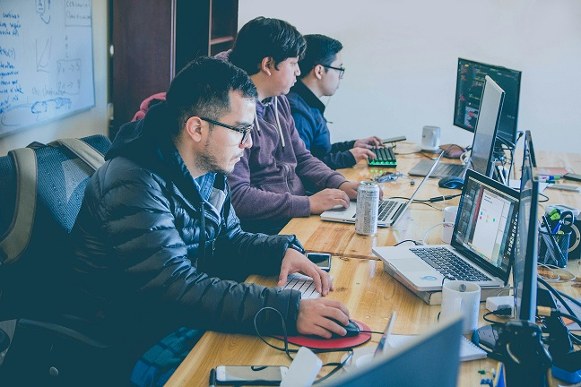
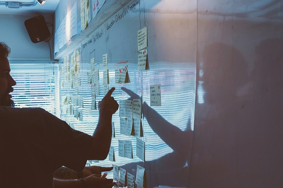

    <h1>Proyecto Finalización Etapa 1  Grupo de Estudio DWFS-C16  Soft Skill</h1>

    <h2><strong>Desarrollo del Proyecto:</strong> Resolución de un Conflicto en Desarrollo Web</h2>

    
    

<h3>Proyecto finalización etapa 1 - Soft Skill.</h3>

Los estudiantes deberán confeccionar un informe basado en los conceptos adquiridos (`Liderazgo`, `Resolución de Conflictos`, `Empatía y Escucha Activa`, `Adaptabilidad`, `Trabajo en Equipo`.)

**Problema**: El equipo de desarrollo necesita lanzar una plataforma web de gestion de RRHH de un Colegio antes de una fecha límite, pero surge un conflicto en el equipo respecto a que existe una plataforma antigua desarrollada en PHP. Además, la tecnología que planean usar es sobre un stack de programación más moderno, por lo cual existen diferencias entre adaptar la plataforma o generar una nueva más escalable y responsive.

# 📚 Estructura del Informe #

1. ## Introducción ## 

    - Presentación y contexto.

    - Planteamiento del problema central.

2. ## Marco Teórico ##

    - `Liderazgo`: ¿Qué rol juega el líder en la resolución de conflictos? ¿Cómo puede fomentar la colaboración y la toma de decisiones?

    - `Resolución de conflictos`: ¿Cuáles son las principales técnicas de resolución de conflictos? ¿Cómo aplicarlas en este caso específico?

    - `Empatía y escucha activa`: ¿Cómo escuchar las diferentes perspectivas de los miembros del equipo? ¿Cómo comprender las emociones y necesidades de cada uno?

    - `Adaptabilidad`: ¿Cómo manejar los cambios y las incertidumbres propias de un proyecto de desarrollo de software?

    - `Trabajo en equipo`: ¿Cómo fomentar la colaboración y el trabajo en equipo en situaciones de conflicto?

3. ## Análisis del caso ##

    - `Identificación de las partes involucradas`: Desarrolladores, jefe de proyecto, stakeholders del colegio, etc.

    - `Análisis de las posiciones`: ¿Cuáles son los argumentos a favor y en contra de cada opción (adaptar o crear una nueva plataforma)?
    
    - `Identificación de los intereses subyacentes`: ¿Qué necesidades y objetivos tiene cada parte involucrada?

4. ## Propuesta de solución ##

    - `Aplicación de los conceptos teóricos`: ¿Cómo se pueden aplicar los conceptos de liderazgo, resolución de conflictos, etc. para encontrar una solución?

    - `Elaboración de un plan de acción`: ¿Cuáles son los pasos a seguir para implementar la solución?

    - `Consideración de las ventajas y desventajas de cada opción`: ¿Cuáles son los posibles riesgos y beneficios de cada alternativa?

5. ### Conclusiones ##

    - Resumen de los principales hallazgos.

    - Reflexión sobre la importancia de los soft skills en la gestión de proyectos.

    - Recomendaciones para futuros proyectos.

<h2>Informe Final: Resolución de Conflictos en el Desarrollo de una Plataforma Web.</h2>

# 📖 Introducción #

En el presente informe se analizará el caso un equipo de desarrollo encargado de la creación de una plataforma web de gestión de Recursos Humanos para un Colegio. El proyecto se encuentra bajo una presión temporal considerable, lo que ha generado un conflicto interno relacionado con la decisión de adaptar una plataforma existente en **PHP** o desarrollar una nueva desde cero utilizando un **stack** de programación más moderno. Este conflicto ha puesto de manifiesto la importancia de las habilidades blandas, como el liderazgo, la resolución de conflictos, la empatía y el trabajo en equipo, en el éxito de un proyecto de desarrollo de software.

# 📰 Marco Teórico #

En este contexto, resulta fundamental comprender el papel del `liderazgo` en la gestión de conflictos. Un líder eficaz debe ser capaz de fomentar un ambiente de trabajo colaborativo, mediar en las diferencias y tomar decisiones basadas en el consenso. `La resolución de conflictos`, por su parte, implica identificar las causas subyacentes del conflicto, buscar soluciones mutuamente beneficiosas y establecer mecanismos para prevenir futuros desacuerdos.

`La empatía y la escucha activa` son habilidades esenciales para comprender las perspectivas de cada miembro del equipo y construir relaciones sólidas. Al escuchar atentamente a las opiniones de los demás, se puede identificar los intereses comunes y encontrar soluciones que satisfagan las necesidades de todos.

`La adaptabilidad` es otra habilidad clave en el desarrollo de software, ya que los proyectos a menudo se enfrentan a cambios inesperados. La capacidad de adaptarse a nuevas situaciones y encontrar soluciones creativas es fundamental para el éxito del proyecto.

Finalmente, el `Trabajo en Equipo` es esencial para lograr objetivos comunes. Al fomentar la colaboración y la comunicación abierta, se pueden superar los obstáculos y alcanzar resultados superiores.

# 📈 Análisis del Caso #

En el caso analizado, las partes involucradas son los desarrolladores del equipo, el jefe de proyecto y los stakeholders del colegio. Las principales posiciones son:

- **A favor de adaptar la plataforma existente**: Argumentan que adaptar la plataforma existente permitiría ahorrar tiempo y recursos, ya que se aprovecharía una parte del código ya desarrollado.

- **A favor de desarrollar una nueva plataforma**: Argumentan que desarrollar una nueva plataforma desde cero permitiría utilizar tecnologías más modernas, mejorar la escalabilidad y la responsividad de la plataforma, y a largo plazo reducir los costos de mantenimiento.
 

    

 
Los intereses subyacentes de cada parte involucrada son:

- **Desarrolladores**: Desean trabajar con tecnologías modernas y desarrollar un producto de calidad.

- **Jefe de proyecto**: Desea cumplir con los plazos y el presupuesto establecidos.

- **Stakeholders del colegio**: Desean una plataforma funcional y escalable que satisfaga sus necesidades.

# ✔️ Propuesta de Solución #

Para resolver este conflicto, se propone la creación de un **Equipo de trabajo multidisciplinario** que incluya a __desarrolladores__ con experiencia en ambas tecnologías. 

Este Equipo se encargará de realizar un análisis detallado de las ventajas y desventajas de cada opción, considerando factores técnicos, económicos y de tiempo.

A partir de este análisis, se podría optar por una solución híbrida, donde se adapten ciertas partes de la plataforma existente y se desarrollen otras nuevas utilizando el stack moderno. Esta solución permitiría aprovechar los beneficios de ambas opciones y minimizar los riesgos.

 

    

 

# 💠 Conclusiones #

El caso analizado demuestra la importancia de las habilidades blandas en la gestión de proyectos de desarrollo de software. Al aplicar los conceptos de `liderazgo`, `resolución de conflictos`, `empatía`, `adaptabilidad` y `trabajo en equipo`, se puede encontrar soluciones efectivas a los desafíos que surgen en el desarrollo de software.

En este caso en particular, **se recomienda** la **creación de un equipo de trabajo multidisciplinario** para evaluar las diferentes opciones y encontrar una solución que satisfaga las necesidades de todas las partes involucradas.
 

    

 

***Luis Marcelo Riquelme***

***Bootcamp UDD DWFS C16***